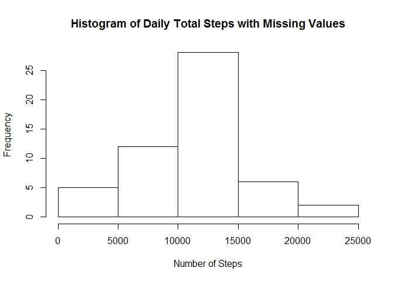
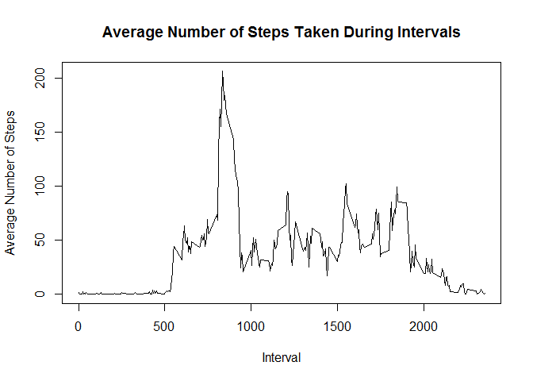
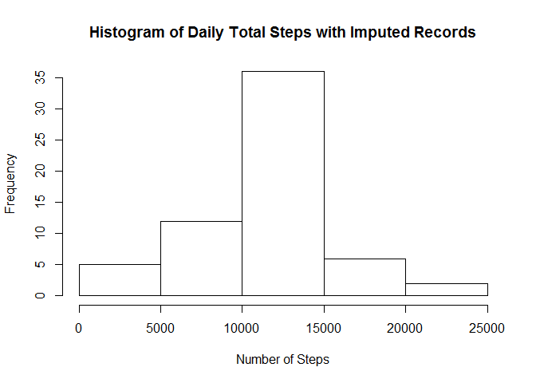

# Reproducible Research: Peer Assessment 1


###About the Research

It is now possible to collect a large amount of data about personal movement using activity monitoring devices such as a Fitbit, Nike Fuelband, or Jawbone Up. These type of devices are part of the "quantified self" movement - a group of enthusiasts who take measurements about themselves regularly to improve their health, to find patterns in their behavior, or because they are tech geeks. But these data remain under-utilized both because the raw data are hard to obtain and there is a lack of statistical methods and software for processing and interpreting the data.

This assignment makes use of data from a personal activity monitoring device. This device collects data at 5 minute intervals through out the day. The data consists of two months of data from an anonymous individual collected during the months of October and November, 2012 and include the number of steps taken in 5 minute intervals each day.

### Data
The data for this assignment was downloaded from the course web
site:

* Dataset: [Activity monitoring data](https://d396qusza40orc.cloudfront.net/repdata%2Fdata%2Factivity.zip) [52K]

The variables included in this dataset are:

* **steps**: Number of steps taking in a 5-minute interval (missing
    values are coded as `NA`)

* **date**: The date on which the measurement was taken in YYYY-MM-DD
    format

* **interval**: Identifier for the 5-minute interval in which
    measurement was taken
    
## Loading and preprocessing the data    
    
1. Loading the data
  
- Checking whether the working directory has the file if not downloading the file and reading into "activity" object
(note: "s" is deliberately deleted from "https" from the URL because it causes problems in my system, in case there is a problem with downloading you may change "http" into "https")
  


```r
if(!file.exists("activity.csv")){
    temp <- tempfile()
		URL ="http://d396qusza40orc.cloudfront.net/repdata%2Fdata%2Factivity.zip"
		download.file(URL,destfile ="./activity.zip")
		activity <- read.csv(unzip("activity.zip"))
	}else{
		activity <- read.csv("activity.csv")
	}

str(activity)
```

```
## 'data.frame':	17568 obs. of  3 variables:
##  $ steps   : int  NA NA NA NA NA NA NA NA NA NA ...
##  $ date    : Factor w/ 61 levels "2012-10-01","2012-10-02",..: 1 1 1 1 1 1 1 1 1 1 ...
##  $ interval: int  0 5 10 15 20 25 30 35 40 45 ...
```


2.Processing data
  
- Converting date variable from factor to date format with the help of "as.date" function
 

```r
activity$date <- as.Date(activity$date, "%Y-%m-%d")
str(activity)
```

```
## 'data.frame':	17568 obs. of  3 variables:
##  $ steps   : int  NA NA NA NA NA NA NA NA NA NA ...
##  $ date    : Date, format: "2012-10-01" "2012-10-01" ...
##  $ interval: int  0 5 10 15 20 25 30 35 40 45 ...
```


## What is mean total number of steps taken per day?

1.Calculating the total number of steps taken per day

```r
DailySums <- aggregate(steps~date,activity,sum)
```


2.Making a histogram of the total number of steps taken each day.


```r
hist(DailySums$steps, main = "Histogram of Daily Total Steps with Missing Values", xlab= "Number of Steps")
```

 

3. Calculating and reporting the mean and median of the total number of steps taken per day

```r
Mean1 <- mean(DailySums$steps)
Median1 <- median(DailySums$steps)
```

The Mean is 1.0766189\times 10^{4} and Median is 10765

## What is the average daily activity pattern?

1.Making a time Series plot  of the 5-minute interval and the average number of steps taken, averaged across all days interval :  


```r
IntMean <- aggregate(steps~interval,activity,mean)
with(IntMean, plot(interval,steps, type="l", main = " Average Number of Steps Taken During Intervals ", xlab="Interval", ylab= "Average Number of Steps"))
```

 

2.Finding which interval contains the maximum number of steps:


```r
Max1<- which.max(IntMean$steps)

MaxInterval <- IntMean[Max1,]$interval
```

The interval with the maximum number of steps is  835 

## Imputing missing values
 
 
1.Calculating and reporting the total number of missing values in the dataset   
  
- The number of rows with missing values( i.e NA's) can be calculated with complete cases  
Since TRUE values is annoted with "1" the sum function can be used to find out complete cases

```r
missing <-complete.cases(activity)
NumComplete <- sum(missing)
NumIncomplete <-nrow(activity)-NumComplete
```

- The number of records with missing values is 2304
  
2.Filling Missing Values with Interval Means

```r
MergedData <- merge(activity,IntMean,by.x ="interval",by.y = "interval",all=TRUE)
colnames(MergedData) <- c("interval","steps","date","IntervalMean")
```
  
3.Creating a new dataset that is equal to the original dataset but with the missing values filled in.  

```r
MergedData[is.na(MergedData$steps),]$steps <- MergedData[is.na(MergedData$steps),]$IntervalMean
str(MergedData)
```

```
## 'data.frame':	17568 obs. of  4 variables:
##  $ interval    : int  0 0 0 0 0 0 0 0 0 0 ...
##  $ steps       : num  1.72 0 0 0 0 ...
##  $ date        : Date, format: "2012-10-01" "2012-11-23" ...
##  $ IntervalMean: num  1.72 1.72 1.72 1.72 1.72 ...
```
   
4.Making a histogram of the total number of steps taken each day and Calculate and report the mean and median total number of steps taken per day
  
- The Histogram :  

```r
DailySumsImputed<-aggregate(steps~date,MergedData,sum)
hist(DailySumsImputed$steps, main = "Histogram of Daily Total Steps with Imputed Records", xlab= "Number of Steps")
```

 
    
- Calculating the mean and median total number of steps taken per day:  

```r
Mean2 <-mean(DailySumsImputed$steps)
Median2 <-median(DailySumsImputed$steps)
str(DailySumsImputed)
```

```
## 'data.frame':	61 obs. of  2 variables:
##  $ date : Date, format: "2012-10-01" "2012-10-02" ...
##  $ steps: num  10766 126 11352 12116 13294 ...
```
   
- The mean is  1.0766189\times 10^{4} and the median is "r Median2". 
   
- Since the missing values are based on interval averages there is no change between the original data and the imputed data in terms of mean and median. However a closer look to the histograms show that there is an increase in middle (i.e increase in the number of days with average value)
  

## Are there differences in activity patterns between weekdays and weekends?  

1.Creating a new factor variable in the dataset with two levels - "weekday" and "weekend" indicating whether a given date is a weekday or weekend day:
  

```r
MergedData$Weekdays <- weekdays(MergedData$date)
MergedData$Weekend <- factor(MergedData$Weekdays %in% c("Saturday","Sunday"))
levels(MergedData$Weekend) <-c("Weekday","Weekend")
```
  
2.Making a time series panel lot of the 5-minute interval and the average number of steps taken, averaged across all weekday days or weekend days.
  
- First we are creating a new dataframe with averaged steps for the intervals both for weekend and weekdays  


```r
WeekendInterval <- aggregate(steps~interval+Weekend,data=MergedData,mean)
```

  
- And then the panel plot for it:  
(because of its ease of use I'm using lattice package for this plot)


```r
library(lattice)
```

```
## Warning: package 'lattice' was built under R version 3.1.3
```

```r
xyplot(steps~interval|Weekend,data=WeekendInterval,layout=c(1,2),type="l")
```

 


- It seems that weekday mornings are more active compared to weekends where activity is more homogenously spread throughout the day.
